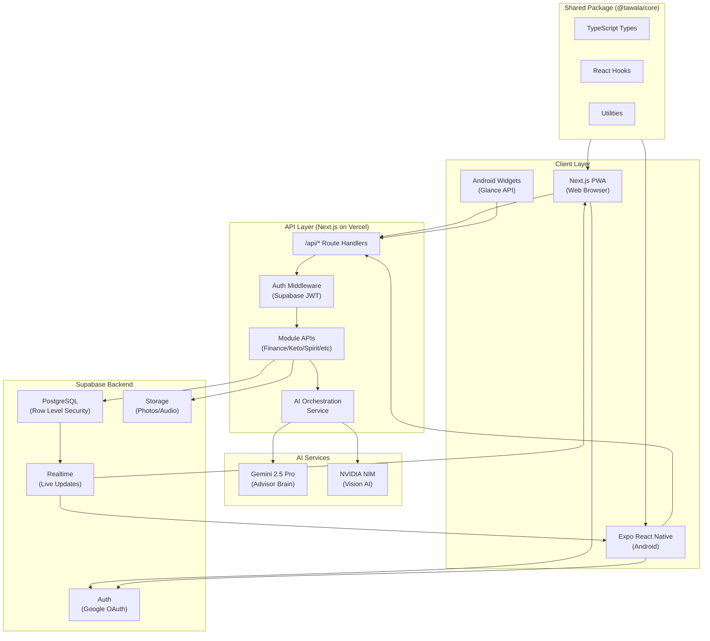
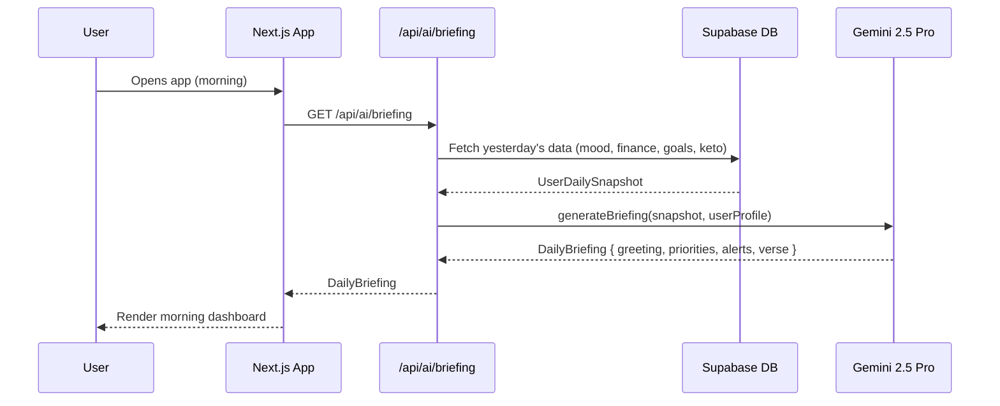
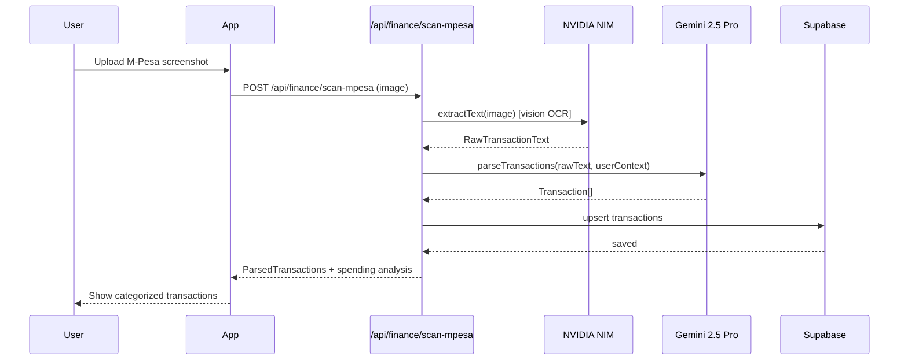
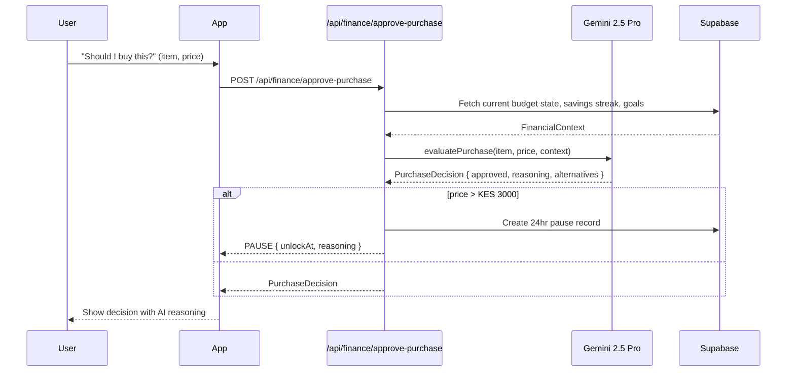
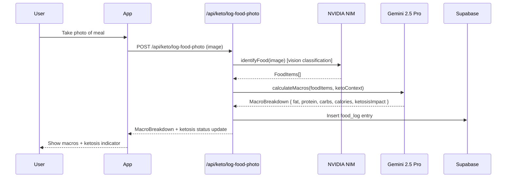

# Design Document: TAWALA Life OS

## Overview

TAWALA (Swahili: "Reign/Rule") is a Progressive Web App and Android application serving as a personal Life Operating System for Eugine Micah, a young Kenyan professional. It integrates Gemini 2.5 Pro as the AI advisor brain and NVIDIA NIM for vision tasks (food scanning, M-Pesa screenshot reading), built on Next.js + Supabase + Expo/React Native.

The system is organized into 8 MVP modules — Finance, Keto, Spirit, Goals & Risk, Family & Relationships, Mental Health, Widgets, and AI Brain — with 6 post-MVP modules planned. All modules share a unified data layer, gamification engine, and AI orchestration layer, with offline-first PWA support and AMOLED dark mode.

The architecture follows a modular monorepo pattern: a Next.js web app (PWA), an Expo React Native mobile app sharing business logic, a Supabase backend for auth/data/realtime, and a Next.js API layer that proxies Gemini 2.5 Pro and NVIDIA NIM calls. Deployment targets Vercel (web) with the mobile app distributed via Expo EAS.

## Architecture



## Sequence Diagrams

### Daily Briefing Flow



### M-Pesa Screenshot Scan Flow



### Purchase Approval Flow



### Food Photo Logging Flow



## Components and Interfaces

### Component 1: AI Orchestration Service

**Purpose**: Single entry point for all AI calls, routing between Gemini 2.5 Pro and NVIDIA NIM based on task type, with caching and rate limiting.

**Interface**:

```typescript
interface AIOrchestrationService {
  generateDailyBriefing(userId: string): Promise<DailyBriefing>;
  evaluatePurchase(req: PurchaseRequest): Promise<PurchaseDecision>;
  generateMoneyLetter(userId: string, month: string): Promise<MoneyLetter>;
  scanMpesaScreenshot(imageUrl: string): Promise<Transaction[]>;
  logFoodPhoto(imageUrl: string, userId: string): Promise<MacroBreakdown>;
  chatWithAdvisor(userId: string, message: string): Promise<AdvisorResponse>;
  projectFutureYou(userId: string): Promise<FutureYouProjection>;
  evaluateDecision(
    userId: string,
    decision: DecisionRequest,
  ): Promise<DecisionResult>;
}
```

**Responsibilities**:

- Route vision tasks (food, M-Pesa) to NVIDIA NIM
- Route reasoning/advisory tasks to Gemini 2.5 Pro
- Cache AI responses (Redis/Supabase) to reduce API costs
- Inject user context (profile, goals, financial state) into every prompt

### Component 2: Finance OS Module

**Purpose**: Manages KES 45,000/month budget allocation, transaction tracking, purchase approval, and savings gamification.

**Interface**:

```typescript
interface FinanceOSModule {
  getBudgetAllocation(userId: string): Promise<BudgetAllocation>;
  recordTransaction(tx: TransactionInput): Promise<Transaction>;
  approvePurchase(req: PurchaseRequest): Promise<PurchaseDecision>;
  scanMpesaStatement(imageUrl: string): Promise<Transaction[]>;
  getWeeklyBreakdown(userId: string, week: string): Promise<SpendingBreakdown>;
  getSavingsStreak(userId: string): Promise<SavingsStreak>;
  getMonthlyLetter(userId: string, month: string): Promise<MoneyLetter>;
  createImpulsePause(
    userId: string,
    item: string,
    amount: number,
  ): Promise<ImpulsePause>;
}
```

### Component 3: Keto OS Module

**Purpose**: Manages weekly meal plans, macro tracking, food photo logging, and ketosis monitoring for KES 5k/month budget.

**Interface**:

```typescript
interface KetoOSModule {
  getWeeklyMealPlan(userId: string, week: string): Promise<MealPlan>;
  logFoodEntry(entry: FoodLogInput): Promise<FoodLogEntry>;
  logFoodPhoto(imageUrl: string, userId: string): Promise<MacroBreakdown>;
  getDailyMacros(userId: string, date: string): Promise<DailyMacros>;
  logWaterIntake(userId: string, ml: number): Promise<WaterLog>;
  getKetosisStatus(userId: string): Promise<KetosisStatus>;
  getShoppingList(userId: string, week: string): Promise<ShoppingList>;
  calculateCheatRisk(userId: string): Promise<CheatRiskScore>;
}
```

### Component 4: Spirit OS Module

**Purpose**: Daily Bible verse delivery, prayer prompts, scripture memory via spaced repetition, and spiritual health scoring.

**Interface**:

```typescript
interface SpiritOSModule {
  getDailyVerse(userId: string, date: string): Promise<BibleVerse>;
  getMorningPrayer(userId: string): Promise<PrayerPrompt>;
  getMemoryVerses(userId: string): Promise<MemoryVerse[]>;
  reviewMemoryVerse(
    userId: string,
    verseId: string,
    quality: 0 | 1 | 2 | 3 | 4 | 5,
  ): Promise<MemoryVerse>;
  addGratitudeEntry(userId: string, entry: string): Promise<GratitudeEntry>;
  getWeeklySpiritScore(userId: string, week: string): Promise<SpiritScore>;
}
```

### Component 5: Goals & Risk OS Module

**Purpose**: Monthly goal setting, weekly breakdowns, habit tracking with streaks, and AI-powered decision engine.

**Interface**:

```typescript
interface GoalsRiskOSModule {
  setMonthlyGoal(userId: string, goal: GoalInput): Promise<Goal>;
  getWeeklyBreakdown(
    userId: string,
    goalId: string,
  ): Promise<WeeklyGoalBreakdown>;
  getRiskScore(userId: string): Promise<RiskScore>;
  evaluateDecision(
    userId: string,
    req: DecisionRequest,
  ): Promise<DecisionResult>;
  logHabit(
    userId: string,
    habitId: string,
    completed: boolean,
  ): Promise<HabitLog>;
  getHabitStreaks(userId: string): Promise<HabitStreak[]>;
  getMorningRoutine(userId: string): Promise<MorningRoutine>;
  getEveningReview(userId: string): Promise<EveningReview>;
}
```

### Component 6: Mental Health OS Module

**Purpose**: Daily mood and stress tracking, burnout risk detection, CBT thought journaling, sleep quality, and win logging.

**Interface**:

```typescript
interface MentalHealthOSModule {
  logMood(userId: string, mood: MoodLevel, note?: string): Promise<MoodEntry>;
  logStress(userId: string, level: StressLevel): Promise<StressEntry>;
  getBurnoutRisk(userId: string): Promise<BurnoutRisk>;
  addThoughtEntry(userId: string, thought: CBTThoughtInput): Promise<CBTEntry>;
  logSleep(userId: string, entry: SleepInput): Promise<SleepEntry>;
  logWin(userId: string, win: string): Promise<WinEntry>;
  getMentalHealthSummary(
    userId: string,
    period: string,
  ): Promise<MentalHealthSummary>;
}
```

### Component 7: Gamification Engine

**Purpose**: XP calculation, level progression, badge awards, and streak management across all modules.

**Interface**:

```typescript
interface GamificationEngine {
  awardXP(userId: string, action: XPAction): Promise<XPResult>;
  getUserLevel(userId: string): Promise<UserLevel>;
  checkBadges(userId: string): Promise<Badge[]>;
  getStreaks(userId: string): Promise<Streak[]>;
  getLeaderboard(circleId: string): Promise<LeaderboardEntry[]>;
  getWeeklyLifeScore(userId: string, week: string): Promise<LifeScore>;
}
```

### Component 8: Widget System

**Purpose**: Provides data endpoints for Android home screen widgets and PWA widget components.

**Interface**:

```typescript
interface WidgetSystem {
  getBibleVerseWidget(userId: string): Promise<BibleVerseWidgetData>;
  getKetoMealWidget(userId: string): Promise<KetoMealWidgetData>;
  getFinanceBalanceWidget(userId: string): Promise<FinanceBalanceWidgetData>;
  getDailyGoalWidget(userId: string): Promise<DailyGoalWidgetData>;
  getMoodCheckinWidget(userId: string): Promise<MoodCheckinWidgetData>;
  getWaterTrackerWidget(userId: string): Promise<WaterTrackerWidgetData>;
}
```

## Data Models

### Core User Profile

```typescript
interface UserProfile {
  id: string; // Supabase UUID
  email: string; // euginemicah@gmail.com
  full_name: string;
  avatar_url: string | null;
  monthly_income_kes: number; // 45000
  keto_budget_kes: number; // 5000
  language: "en" | "sw"; // English or Swahili
  legacy_statement: string; // Permanent tagline
  created_at: string;
  updated_at: string;
}
```

### Finance Models

```typescript
interface Transaction {
  id: string;
  user_id: string;
  amount_kes: number;
  type: "income" | "expense" | "transfer" | "savings";
  category: TransactionCategory;
  description: string;
  source: "manual" | "mpesa_scan" | "auto";
  mpesa_ref: string | null;
  date: string;
  created_at: string;
}

type TransactionCategory =
  | "food"
  | "transport"
  | "rent"
  | "utilities"
  | "entertainment"
  | "health"
  | "savings"
  | "investment"
  | "family_support"
  | "tithe"
  | "other";

interface BudgetAllocation {
  user_id: string;
  month: string; // YYYY-MM
  total_income_kes: number; // 45000
  allocations: {
    rent: number; // 15000
    food_keto: number; // 5000
    transport: number; // 5000
    savings: number; // 10000
    family_support: number; // 3000
    tithe: number; // 4500
    entertainment: number; // 2500
    buffer: number; // remaining
  };
  actual_spent: Record<TransactionCategory, number>;
}

interface ImpulsePause {
  id: string;
  user_id: string;
  item_name: string;
  amount_kes: number;
  created_at: string;
  unlock_at: string; // +24 hours
  status: "pending" | "approved" | "cancelled";
  ai_reasoning: string;
}

interface SavingsStreak {
  user_id: string;
  current_streak_days: number;
  longest_streak_days: number;
  last_savings_date: string;
  total_saved_kes: number;
}
```

### Keto Models

```typescript
interface FoodLogEntry {
  id: string;
  user_id: string;
  date: string;
  meal_type: "breakfast" | "lunch" | "dinner" | "snack";
  food_items: FoodItem[];
  total_macros: MacroBreakdown;
  logged_via: "manual" | "photo" | "meal_plan";
  photo_url: string | null;
  created_at: string;
}

interface MacroBreakdown {
  fat_g: number;
  protein_g: number;
  carbs_g: number;
  calories: number;
  net_carbs_g: number;
  ketosis_impact: "positive" | "neutral" | "negative";
}

interface DailyMacros {
  user_id: string;
  date: string;
  target: MacroBreakdown;
  actual: MacroBreakdown;
  water_ml: number;
  water_target_ml: number; // 3000
  ketosis_status: KetosisStatus;
}

interface KetosisStatus {
  level: "deep" | "light" | "borderline" | "out";
  estimated_score: number; // 0-100
  days_in_ketosis: number;
  cheat_risk_score: number; // 0-100
}

interface MealPlan {
  user_id: string;
  week: string; // YYYY-WW
  budget_kes: number;
  days: MealPlanDay[];
  shopping_list: ShoppingItem[];
}

interface ShoppingItem {
  name: string;
  quantity: string;
  estimated_cost_kes: number;
  market: "Gikomba" | "Wakulima" | "Supermarket" | "Local";
}
```

### Spirit Models

```typescript
interface BibleVerse {
  id: string;
  reference: string; // e.g. "Proverbs 3:5-6"
  text_en: string;
  text_sw: string;
  theme: string;
  date: string;
}

interface MemoryVerse {
  id: string;
  user_id: string;
  verse_id: string;
  verse: BibleVerse;
  ease_factor: number; // SM-2 algorithm
  interval_days: number;
  next_review: string;
  repetitions: number;
  last_reviewed: string | null;
}

interface GratitudeEntry {
  id: string;
  user_id: string;
  content: string;
  date: string;
  created_at: string;
}

interface SpiritScore {
  user_id: string;
  week: string;
  verse_streak: number;
  prayer_streak: number;
  memory_reviews: number;
  gratitude_entries: number;
  score: number; // 0-100
}
```

### Goals & Habits Models

```typescript
interface Goal {
  id: string;
  user_id: string;
  title: string;
  description: string;
  month: string; // YYYY-MM
  is_primary: boolean; // monthly #1 goal
  status: "active" | "completed" | "abandoned";
  progress_percent: number;
  weekly_breakdowns: WeeklyGoalBreakdown[];
  created_at: string;
}

interface Habit {
  id: string;
  user_id: string;
  name: string;
  description: string;
  frequency: "daily" | "weekly";
  module: ModuleType;
  target_count: number;
  current_streak: number;
  longest_streak: number;
  is_morning_routine: boolean;
  order: number;
}

interface HabitLog {
  id: string;
  user_id: string;
  habit_id: string;
  date: string;
  completed: boolean;
  note: string | null;
}

type ModuleType =
  | "finance"
  | "keto"
  | "spirit"
  | "goals"
  | "family"
  | "mental_health";
```

### Mental Health Models

```typescript
type MoodLevel = 1 | 2 | 3 | 4 | 5; // 😢 😕 😐 🙂 😄
type StressLevel = 1 | 2 | 3 | 4 | 5;

interface MoodEntry {
  id: string;
  user_id: string;
  mood: MoodLevel;
  stress: StressLevel;
  note: string | null;
  date: string;
  time_of_day: "morning" | "afternoon" | "evening";
  created_at: string;
}

interface CBTEntry {
  id: string;
  user_id: string;
  situation: string;
  automatic_thought: string;
  emotion: string;
  cognitive_distortion: string | null;
  rational_response: string | null;
  outcome_mood: MoodLevel | null;
  date: string;
}

interface SleepEntry {
  id: string;
  user_id: string;
  date: string;
  bedtime: string;
  wake_time: string;
  duration_hours: number;
  quality: 1 | 2 | 3 | 4 | 5;
  notes: string | null;
}

interface BurnoutRisk {
  user_id: string;
  score: number; // 0-100
  level: "low" | "moderate" | "high" | "critical";
  factors: string[];
  recommendations: string[];
  assessed_at: string;
}
```

### Gamification Models

```typescript
interface UserLevel {
  user_id: string;
  xp_total: number;
  level: number;
  level_name: string; // e.g. "Mwanzo" (Beginner) → "Mfalme" (King)
  xp_to_next_level: number;
  badges: Badge[];
}

interface Badge {
  id: string;
  name: string;
  name_sw: string;
  description: string;
  icon: string;
  module: ModuleType | "global";
  earned_at: string | null;
}

interface XPAction {
  action: string; // e.g. 'log_mood', 'complete_habit', 'log_food'
  module: ModuleType;
  xp_value: number;
}

interface LifeScore {
  user_id: string;
  week: string;
  finance_score: number; // 0-100 each
  keto_score: number;
  spirit_score: number;
  goals_score: number;
  mental_health_score: number;
  family_score: number;
  overall_score: number; // weighted average
  trend: "up" | "down" | "stable";
}
```

## Algorithmic Pseudocode

### Budget Allocation Algorithm

```pascal
ALGORITHM allocateBudget(monthlyIncome, userPreferences)
INPUT: monthlyIncome: number (KES), userPreferences: AllocationPreferences
OUTPUT: BudgetAllocation

BEGIN
  ASSERT monthlyIncome > 0
  ASSERT monthlyIncome = 45000  // Eugine's fixed income

  // Fixed obligations first (non-negotiable)
  tithe ← monthlyIncome * 0.10          // KES 4,500
  rent ← userPreferences.rent           // KES 15,000
  savings_target ← monthlyIncome * 0.22 // KES 10,000

  // Variable allocations
  food_keto ← 5000                       // Fixed keto budget
  transport ← 5000
  family_support ← 3000                  // Brother allowance + family

  // Calculate buffer
  fixed_total ← tithe + rent + savings_target + food_keto + transport + family_support
  entertainment ← 2500
  buffer ← monthlyIncome - fixed_total - entertainment

  ASSERT buffer >= 0  // Warn if negative

  RETURN BudgetAllocation {
    total: monthlyIncome,
    allocations: { tithe, rent, savings_target, food_keto, transport, family_support, entertainment, buffer }
  }
END
```

### Purchase Approval Algorithm

```pascal
ALGORITHM evaluatePurchase(item, amountKES, financialContext)
INPUT: item: string, amountKES: number, financialContext: FinancialContext
OUTPUT: PurchaseDecision

BEGIN
  ASSERT amountKES > 0

  // Check 24-hour rule threshold
  IF amountKES >= 3000 THEN
    existingPause ← findActivePause(financialContext.userId, item)
    IF existingPause IS NULL THEN
      pause ← createImpulsePause(item, amountKES, now() + 24h)
      RETURN PurchaseDecision { approved: false, type: 'PAUSE', pause, reasoning: AI_REASONING }
    ELSE IF now() < existingPause.unlock_at THEN
      RETURN PurchaseDecision { approved: false, type: 'STILL_PAUSED', pause: existingPause }
    END IF
  END IF

  // Budget check
  categoryBudget ← financialContext.allocations[inferCategory(item)]
  categorySpent ← financialContext.actualSpent[inferCategory(item)]
  remaining ← categoryBudget - categorySpent

  IF amountKES > remaining THEN
    RETURN PurchaseDecision { approved: false, type: 'OVER_BUDGET', remaining, reasoning: AI_REASONING }
  END IF

  // Savings streak protection
  IF financialContext.savingsStreak.current_streak_days >= 7 AND amountKES > remaining * 0.5 THEN
    // Warn but don't block
    RETURN PurchaseDecision { approved: true, type: 'CAUTION', warning: 'Streak at risk', reasoning: AI_REASONING }
  END IF

  RETURN PurchaseDecision { approved: true, type: 'APPROVED', reasoning: AI_REASONING }
END
```

### Ketosis Status Algorithm

```pascal
ALGORITHM calculateKetosisStatus(recentFoodLogs, waterLogs)
INPUT: recentFoodLogs: FoodLogEntry[] (last 3 days), waterLogs: WaterLog[]
OUTPUT: KetosisStatus

BEGIN
  ASSERT LENGTH(recentFoodLogs) > 0

  // Calculate average daily net carbs over last 3 days
  totalNetCarbs ← 0
  FOR each day IN recentFoodLogs DO
    totalNetCarbs ← totalNetCarbs + day.total_macros.net_carbs_g
  END FOR
  avgNetCarbs ← totalNetCarbs / LENGTH(recentFoodLogs)

  // Determine ketosis level
  IF avgNetCarbs <= 20 THEN
    level ← 'deep'
    score ← 90 + (20 - avgNetCarbs) * 0.5
  ELSE IF avgNetCarbs <= 30 THEN
    level ← 'light'
    score ← 70 + (30 - avgNetCarbs) * 2
  ELSE IF avgNetCarbs <= 50 THEN
    level ← 'borderline'
    score ← 40 + (50 - avgNetCarbs)
  ELSE
    level ← 'out'
    score ← MAX(0, 40 - (avgNetCarbs - 50))
  END IF

  // Cheat risk: based on recent trend
  trend ← calculateCarbTrend(recentFoodLogs)
  cheatRisk ← IF trend = 'increasing' THEN MIN(100, score + 30) ELSE score * 0.3

  RETURN KetosisStatus { level, estimated_score: MIN(100, score), cheat_risk_score: cheatRisk }
END
```

### Spaced Repetition (SM-2) for Scripture Memory

```pascal
ALGORITHM reviewMemoryVerse(verse, quality)
INPUT: verse: MemoryVerse, quality: 0..5 (0=blackout, 5=perfect)
OUTPUT: Updated MemoryVerse

BEGIN
  ASSERT quality >= 0 AND quality <= 5

  IF quality < 3 THEN
    // Failed recall — reset
    verse.repetitions ← 0
    verse.interval_days ← 1
  ELSE
    // Successful recall
    IF verse.repetitions = 0 THEN
      verse.interval_days ← 1
    ELSE IF verse.repetitions = 1 THEN
      verse.interval_days ← 6
    ELSE
      verse.interval_days ← ROUND(verse.interval_days * verse.ease_factor)
    END IF
    verse.repetitions ← verse.repetitions + 1
  END IF

  // Update ease factor (EF)
  verse.ease_factor ← verse.ease_factor + (0.1 - (5 - quality) * (0.08 + (5 - quality) * 0.02))
  verse.ease_factor ← MAX(1.3, verse.ease_factor)

  verse.next_review ← today() + verse.interval_days
  verse.last_reviewed ← today()

  RETURN verse
END
```

### Weekly Life Score Algorithm

```pascal
ALGORITHM calculateWeeklyLifeScore(userId, week)
INPUT: userId: string, week: string (YYYY-WW)
OUTPUT: LifeScore

BEGIN
  // Fetch module data for the week
  financeData ← getWeeklyFinanceData(userId, week)
  ketoData ← getWeeklyKetoData(userId, week)
  spiritData ← getWeeklySpiritData(userId, week)
  goalsData ← getWeeklyGoalsData(userId, week)
  mentalData ← getWeeklyMentalData(userId, week)
  familyData ← getWeeklyFamilyData(userId, week)

  // Score each module 0-100
  finance_score ← scoreFinance(financeData)    // budget adherence + savings
  keto_score ← scoreKeto(ketoData)             // macro adherence + water + ketosis
  spirit_score ← scoreSpiritData(spiritData)   // verse + prayer + gratitude streaks
  goals_score ← scoreGoals(goalsData)          // habit completion + goal progress
  mental_score ← scoreMental(mentalData)       // mood trend + sleep quality
  family_score ← scoreFamily(familyData)       // contributions + check-ins

  // Weighted average (finance and goals weighted higher)
  weights ← { finance: 0.25, keto: 0.15, spirit: 0.15, goals: 0.25, mental: 0.10, family: 0.10 }
  overall ← finance_score * weights.finance
           + keto_score * weights.keto
           + spirit_score * weights.spirit
           + goals_score * weights.goals
           + mental_score * weights.mental
           + family_score * weights.family

  // Trend vs last week
  lastWeekScore ← getLastWeekScore(userId)
  trend ← IF overall > lastWeekScore + 2 THEN 'up'
           ELSE IF overall < lastWeekScore - 2 THEN 'down'
           ELSE 'stable'

  RETURN LifeScore { finance_score, keto_score, spirit_score, goals_score,
                     mental_health_score: mental_score, family_score, overall_score: overall, trend }
END
```

### Burnout Risk Detection Algorithm

```pascal
ALGORITHM assessBurnoutRisk(userId, lookbackDays)
INPUT: userId: string, lookbackDays: number (default 14)
OUTPUT: BurnoutRisk

BEGIN
  moodEntries ← getMoodEntries(userId, lookbackDays)
  sleepEntries ← getSleepEntries(userId, lookbackDays)
  habitLogs ← getHabitLogs(userId, lookbackDays)
  stressEntries ← getStressEntries(userId, lookbackDays)

  // Factor 1: Mood trend (declining = risk)
  avgMood ← AVERAGE(moodEntries.map(e => e.mood))
  moodTrend ← calculateLinearTrend(moodEntries)
  moodRisk ← IF moodTrend < -0.1 THEN 30 ELSE IF avgMood < 3 THEN 20 ELSE 0

  // Factor 2: Sleep deprivation
  avgSleep ← AVERAGE(sleepEntries.map(e => e.duration_hours))
  sleepRisk ← IF avgSleep < 6 THEN 25 ELSE IF avgSleep < 7 THEN 10 ELSE 0

  // Factor 3: Habit completion drop
  recentCompletion ← habitCompletionRate(habitLogs, last 7 days)
  priorCompletion ← habitCompletionRate(habitLogs, prior 7 days)
  habitRisk ← IF recentCompletion < priorCompletion - 0.3 THEN 25 ELSE 0

  // Factor 4: Sustained high stress
  avgStress ← AVERAGE(stressEntries.map(e => e.level))
  stressRisk ← IF avgStress >= 4 THEN 20 ELSE IF avgStress >= 3.5 THEN 10 ELSE 0

  totalScore ← MIN(100, moodRisk + sleepRisk + habitRisk + stressRisk)

  level ← IF totalScore >= 70 THEN 'critical'
           ELSE IF totalScore >= 50 THEN 'high'
           ELSE IF totalScore >= 30 THEN 'moderate'
           ELSE 'low'

  factors ← collectRiskFactors(moodRisk, sleepRisk, habitRisk, stressRisk)
  recommendations ← generateRecommendations(level, factors)  // via Gemini

  RETURN BurnoutRisk { score: totalScore, level, factors, recommendations }
END
```

## Key Functions with Formal Specifications

### generateDailyBriefing()

```typescript
async function generateDailyBriefing(userId: string): Promise<DailyBriefing>;
```

**Preconditions:**

- `userId` is a valid authenticated Supabase user UUID
- User has at least one day of historical data
- Gemini API key is configured and valid

**Postconditions:**

- Returns `DailyBriefing` with non-empty `greeting`, `priorities[]`, and `verse`
- `priorities` contains 3-5 actionable items ordered by urgency
- `alerts` contains any budget overruns, missed habits, or health flags from yesterday
- Response is cached for 6 hours to avoid redundant API calls
- No mutations to user data

**Loop Invariants:** N/A (no loops; parallel data fetches via Promise.all)

---

### scanMpesaScreenshot()

```typescript
async function scanMpesaScreenshot(
  imageUrl: string,
  userId: string,
): Promise<Transaction[]>;
```

**Preconditions:**

- `imageUrl` is a valid Supabase Storage URL
- Image is a valid M-Pesa transaction screenshot (PNG/JPG)
- NVIDIA NIM API key is configured

**Postconditions:**

- Returns array of `Transaction[]` with at least one entry if image contains valid M-Pesa data
- Each transaction has `amount_kes > 0`, valid `date`, and `mpesa_ref`
- Duplicate transactions (same `mpesa_ref`) are deduplicated before return
- Transactions are persisted to `transactions` table
- Returns empty array (not error) if no transactions detected

**Loop Invariants:**

- For deduplication loop: all previously processed refs remain in the seen set

---

### logFoodPhoto()

```typescript
async function logFoodPhoto(
  imageUrl: string,
  userId: string,
  mealType: MealType,
): Promise<MacroBreakdown>;
```

**Preconditions:**

- `imageUrl` is a valid Supabase Storage URL pointing to a food photo
- `userId` is authenticated
- NVIDIA NIM vision API is available

**Postconditions:**

- Returns `MacroBreakdown` with all fields populated (`fat_g >= 0`, `protein_g >= 0`, `carbs_g >= 0`)
- `net_carbs_g <= carbs_g` always
- `ketosis_impact` is one of `'positive' | 'neutral' | 'negative'`
- Food log entry is persisted with the photo URL
- Daily macro totals are updated

---

### reviewMemoryVerse()

```typescript
async function reviewMemoryVerse(
  userId: string,
  verseId: string,
  quality: 0 | 1 | 2 | 3 | 4 | 5,
): Promise<MemoryVerse>;
```

**Preconditions:**

- `quality` is an integer in range [0, 5]
- `verseId` exists in user's memory verse list
- `verse.next_review <= today()` (verse is due for review)

**Postconditions:**

- `ease_factor >= 1.3` always (SM-2 lower bound)
- If `quality < 3`: `repetitions = 0`, `interval_days = 1`
- If `quality >= 3`: `repetitions` incremented, `interval_days` increases monotonically
- `next_review > today()` always
- XP awarded via gamification engine

---

### calculateWeeklyLifeScore()

```typescript
async function calculateWeeklyLifeScore(
  userId: string,
  week: string,
): Promise<LifeScore>;
```

**Preconditions:**

- `week` is in format `YYYY-WW`
- `userId` is authenticated
- At least one module has data for the given week

**Postconditions:**

- All module scores are in range [0, 100]
- `overall_score` is in range [0, 100]
- `overall_score = Σ(module_score * weight)` where `Σ(weights) = 1.0`
- `trend` reflects comparison to previous week's `overall_score`
- Score is persisted to `life_scores` table for historical tracking

## Example Usage

```typescript
// 1. Morning app open — fetch daily briefing
const briefing = await aiService.generateDailyBriefing(user.id);
// → { greeting: "Habari asubuhi, Eugine! 🌅", priorities: [...], verse: {...}, alerts: [...] }

// 2. Scan M-Pesa screenshot
const file = await uploadToStorage(
  screenshot,
  `mpesa/${user.id}/${Date.now()}.jpg`,
);
const transactions = await financeModule.scanMpesaStatement(file.url);
// → [{ amount_kes: 1200, category: 'food', mpesa_ref: 'QHX7Y...', date: '2025-01-15' }, ...]

// 3. Purchase approval check
const decision = await financeModule.approvePurchase({
  userId: user.id,
  item: "New headphones",
  amount_kes: 4500,
  category: "entertainment",
});
// → { approved: false, type: 'PAUSE', unlock_at: '2025-01-16T14:30:00Z', reasoning: '...' }

// 4. Log food via photo
const photoUrl = await uploadToStorage(
  mealPhoto,
  `food/${user.id}/${Date.now()}.jpg`,
);
const macros = await ketoModule.logFoodPhoto(photoUrl, user.id, "lunch");
// → { fat_g: 45, protein_g: 30, carbs_g: 8, net_carbs_g: 5, ketosis_impact: 'positive' }

// 5. Scripture memory review
const updated = await spiritModule.reviewMemoryVerse(
  user.id,
  "verse-proverbs-3-5",
  4,
);
// → { next_review: '2025-01-21', interval_days: 6, ease_factor: 2.5, repetitions: 2 }

// 6. Log mood
const mood = await mentalModule.logMood(
  user.id,
  4,
  "Good day, finished the project",
);
// → { id: '...', mood: 4, stress: 2, date: '2025-01-15', time_of_day: 'evening' }

// 7. Get weekly life score
const score = await gamification.getWeeklyLifeScore(user.id, "2025-03");
// → { overall_score: 78, finance_score: 85, keto_score: 72, spirit_score: 90, trend: 'up' }

// 8. Future You chat
const projection = await aiService.projectFutureYou(user.id);
// → { age: 35, message: "Eugine at 35 has...", milestones: [...], advice: "..." }
```

## Correctness Properties

_A property is a characteristic or behavior that should hold true across all valid executions of a system — essentially, a formal statement about what the system should do. Properties serve as the bridge between human-readable specifications and machine-verifiable correctness guarantees._

### Property 1: Budget allocations sum to monthly income

_For any_ monthly income value, the sum of all category allocations produced by `allocateBudget()` must equal the total monthly income (within 1 KES rounding tolerance).

**Validates: Requirements 2.1**

---

### Property 2: Fixed allocation percentages are correct

_For any_ monthly income value, the tithe allocation must equal exactly 10% of income and the savings allocation must equal exactly 22% of income.

**Validates: Requirements 2.2, 2.3**

---

### Property 3: Budget buffer is non-negative for standard income

_For any_ monthly income greater than or equal to KES 45,000, the buffer amount in the resulting BudgetAllocation must be greater than or equal to zero.

**Validates: Requirements 2.4**

---

### Property 4: Impulse pause threshold and timing

_For any_ purchase request with amount greater than or equal to KES 3,000, the resulting ImpulsePause must have `amount_kes >= 3000` and `unlock_at` must be strictly greater than `created_at` by exactly 24 hours.

**Validates: Requirements 3.1, 3.4, 3.5**

---

### Property 5: Net carbs never exceed total carbs

_For any_ MacroBreakdown produced by the Keto_Module, `net_carbs_g` must be less than or equal to `carbs_g`, and `fat_g`, `protein_g`, `carbs_g`, and `calories` must all be greater than or equal to zero.

**Validates: Requirements 5.2, 5.3**

---

### Property 6: Ketosis level boundaries are correct

_For any_ set of food logs, the KetosisStatus level must be "deep" when average net carbs ≤ 20g, "light" when > 20g and ≤ 30g, "borderline" when > 30g and ≤ 50g, and "out" when > 50g. Both `estimated_score` and `cheat_risk_score` must be in [0, 100].

**Validates: Requirements 6.1, 6.2, 6.3, 6.4, 6.5**

---

### Property 7: SM-2 ease factor lower bound

_For any_ MemoryVerse and quality rating in [0, 5], the `ease_factor` after `reviewMemoryVerse()` must always be greater than or equal to 1.3.

**Validates: Requirements 7.3**

---

### Property 8: SM-2 failed recall resets state

_For any_ MemoryVerse reviewed with quality less than 3, the resulting verse must have `repetitions = 0` and `interval_days = 1`.

**Validates: Requirements 7.1**

---

### Property 9: SM-2 successful recall advances state monotonically

_For any_ MemoryVerse reviewed with quality greater than or equal to 3, the resulting `repetitions` must be greater than the previous value and `interval_days` must be non-decreasing.

**Validates: Requirements 7.2**

---

### Property 10: Memory verse next_review is after last_reviewed

_For any_ MemoryVerse after any review, `next_review` must be a date strictly after `last_reviewed`.

**Validates: Requirements 7.4**

---

### Property 11: Life score weights sum to 1.0

_For any_ LifeScore calculation, the sum of all module weights (Finance 0.25, Goals 0.25, Keto 0.15, Spirit 0.15, Mental Health 0.10, Family 0.10) must equal exactly 1.0.

**Validates: Requirements 8.1, 8.2**

---

### Property 12: All life scores are bounded [0, 100]

_For any_ set of module scores in [0, 100], the resulting `overall_score` and all individual module scores in the LifeScore must be in the range [0, 100].

**Validates: Requirements 8.3**

---

### Property 13: Life score overall equals weighted sum

_For any_ six module scores, `overall_score` must equal the sum of each module score multiplied by its corresponding weight.

**Validates: Requirements 8.1**

---

### Property 14: Burnout risk score is bounded and level is correctly mapped

_For any_ combination of mood, sleep, habit, and stress inputs, the BurnoutRisk `score` must be in [0, 100], and the `level` must be "critical" when score ≥ 70, "high" when score ≥ 50, "moderate" when score ≥ 30, and "low" otherwise.

**Validates: Requirements 9.1, 9.2**

---

### Property 15: XP award increases total XP by exact action value

_For any_ valid XP action, after `awardXP()` the user's `xp_total` must increase by exactly the `xp_value` of that action.

**Validates: Requirements 10.1**

---

### Property 16: Daily briefing always contains required fields

_For any_ user with at least one day of historical data, the DailyBriefing returned by `generateDailyBriefing()` must contain a non-empty greeting, a non-empty verse, and between 3 and 5 priority items.

**Validates: Requirements 1.1**

---

### Property 17: M-Pesa scan deduplication

_For any_ set of raw transactions containing duplicate M-Pesa reference numbers, the result of `scanMpesaScreenshot()` must contain each reference number at most once.

**Validates: Requirements 4.2**

---

### Property 18: Accountability circle shares only aggregate scores

_For any_ accountability circle API response, the response must contain only LifeScore fields and must not include raw transaction amounts, mood entries, food logs, or other personally identifiable data.

**Validates: Requirements 15.1, 15.2**

---

### Property 19: Signed URL expiry is at most 1 hour

_For any_ signed URL generated for Supabase Storage, the expiry duration must be less than or equal to 3,600 seconds from the time of generation.

**Validates: Requirements 12.4**

## Error Handling

### Error Scenario 1: AI API Unavailable

**Condition**: Gemini or NVIDIA NIM API returns 5xx or times out
**Response**: Return cached response if available (< 6 hours old); otherwise return graceful fallback (static daily verse, simplified briefing without AI narrative)
**Recovery**: Exponential backoff retry (3 attempts: 1s, 2s, 4s); log to Supabase `error_logs` table; surface non-blocking toast to user

### Error Scenario 2: M-Pesa Screenshot Unreadable

**Condition**: NVIDIA NIM cannot extract text from image (blurry, wrong format, non-M-Pesa image)
**Response**: Return `{ transactions: [], error: 'UNREADABLE', message: 'Could not read screenshot. Try a clearer photo.' }`
**Recovery**: Prompt user to retake photo or enter transaction manually; do not persist failed scan

### Error Scenario 3: Budget Allocation Goes Negative

**Condition**: User's actual spending exceeds allocated budget in a category
**Response**: Flag category as `OVER_BUDGET`; block new purchases in that category; trigger Gemini to generate reallocation suggestion
**Recovery**: Show reallocation modal; allow user to accept AI suggestion or manually adjust; log override decision

### Error Scenario 4: Supabase Auth Token Expired

**Condition**: JWT token expires mid-session
**Response**: Silently refresh token via Supabase `onAuthStateChange`; queue failed requests and replay after refresh
**Recovery**: If refresh fails, redirect to login with session state preserved in localStorage for restoration

### Error Scenario 5: Offline Mode

**Condition**: User has no network connectivity
**Response**: Serve cached data from IndexedDB (PWA service worker); allow local writes to offline queue
**Recovery**: On reconnect, sync offline queue to Supabase in chronological order; resolve conflicts with server-wins strategy for financial data, client-wins for journal/mood entries

### Error Scenario 6: Food Photo Returns No Food Items

**Condition**: NVIDIA NIM identifies no food in the photo
**Response**: Return `{ items: [], confidence: 0, message: 'No food detected. Try a closer photo.' }`
**Recovery**: Offer manual macro entry form pre-populated with common Kenyan keto foods

## Testing Strategy

### Unit Testing Approach

Test all pure business logic functions in isolation using Jest + TypeScript. Key test targets:

- `allocateBudget()` — verify allocations sum to income, buffer never negative for standard income
- `evaluatePurchase()` — verify 24hr pause triggers at KES 3000 threshold, budget checks correct
- `calculateKetosisStatus()` — verify level boundaries at 20g, 30g, 50g net carbs
- `reviewMemoryVerse()` — verify SM-2 ease factor floor (1.3), interval progression
- `calculateWeeklyLifeScore()` — verify weights sum to 1.0, scores bounded [0,100]
- `assessBurnoutRisk()` — verify score bounded [0,100], correct factor attribution

### Property-Based Testing Approach

**Property Test Library**: fast-check

```typescript
// Property: Budget allocations always sum to income
fc.assert(
  fc.property(fc.integer({ min: 30000, max: 100000 }), (income) => {
    const allocation = allocateBudget(income, defaultPreferences);
    const total = Object.values(allocation.allocations).reduce(
      (a, b) => a + b,
      0,
    );
    return Math.abs(total - income) < 1; // allow 1 KES rounding
  }),
);

// Property: Net carbs never exceed total carbs
fc.assert(
  fc.property(
    fc.record({
      fat_g: fc.float({ min: 0 }),
      protein_g: fc.float({ min: 0 }),
      carbs_g: fc.float({ min: 0 }),
    }),
    (macros) => {
      const result = calculateNetCarbs(macros);
      return result.net_carbs_g <= result.carbs_g;
    },
  ),
);

// Property: SM-2 ease factor always >= 1.3
fc.assert(
  fc.property(
    fc.integer({ min: 0, max: 5 }),
    fc.float({ min: 1.3, max: 3.0 }),
    (quality, initialEF) => {
      const result = applySpacedRepetition(
        { ease_factor: initialEF, repetitions: 1, interval_days: 6 },
        quality,
      );
      return result.ease_factor >= 1.3;
    },
  ),
);

// Property: Life score overall is always in [0, 100]
fc.assert(
  fc.property(
    fc.tuple(...Array(6).fill(fc.integer({ min: 0, max: 100 }))),
    ([f, k, s, g, m, fam]) => {
      const score = computeOverallScore({
        finance: f,
        keto: k,
        spirit: s,
        goals: g,
        mental: m,
        family: fam,
      });
      return score >= 0 && score <= 100;
    },
  ),
);
```

### Integration Testing Approach

- Test full API route handlers with Supabase test database (separate `tawala_test` project)
- Mock NVIDIA NIM and Gemini APIs with recorded fixtures for deterministic tests
- Test M-Pesa scan end-to-end with sample screenshots
- Test offline sync queue with simulated network interruption
- Test PWA service worker caching with Playwright

## Performance Considerations

- AI API calls are the primary latency source; cache all Gemini responses with 6-hour TTL in Supabase `ai_cache` table
- Daily briefing is pre-generated at 5:00 AM EAT via Vercel Cron Job to ensure instant load on app open
- Food photo and M-Pesa scans are processed asynchronously; UI shows optimistic loading state
- Supabase queries use Row Level Security with indexed `user_id` + `date` composite indexes on all time-series tables
- PWA service worker pre-caches today's meal plan, verse, and budget state for offline access
- Widget data endpoints are edge-cached on Vercel for 5 minutes

## Security Considerations

- All API routes validate Supabase JWT before processing; no unauthenticated endpoints except `/api/health`
- API keys (Gemini, NVIDIA, Supabase) stored as Vercel environment variables, never in client bundle
- M-Pesa screenshots and food photos stored in private Supabase Storage bucket with signed URLs (1-hour expiry)
- Row Level Security enforced on all Supabase tables: `user_id = auth.uid()`
- Google OAuth only (no password auth) — reduces credential attack surface
- Financial data (transactions, budget) encrypted at rest via Supabase's AES-256 storage encryption
- 24-hour impulse pause records are immutable once created (no client-side delete)
- Accountability circle shares only aggregate `LifeScore`, never raw financial or health data

## Dependencies

| Package                           | Purpose                           |
| --------------------------------- | --------------------------------- |
| `next` 15                         | Web framework + API routes        |
| `@supabase/supabase-js`           | Database, auth, storage, realtime |
| `@google/generative-ai`           | Gemini 2.5 Pro SDK                |
| `expo` + `expo-router`            | React Native mobile app           |
| `@tanstack/react-query`           | Data fetching + caching           |
| `zustand`                         | Client state management           |
| `tailwindcss`                     | Styling                           |
| `shadcn/ui`                       | UI component library              |
| `recharts`                        | Finance/health charts             |
| `workbox`                         | PWA service worker                |
| `fast-check`                      | Property-based testing            |
| `jest` + `@testing-library/react` | Unit + component testing          |
| `playwright`                      | E2E testing                       |
| `mermaid`                         | Architecture diagrams             |
